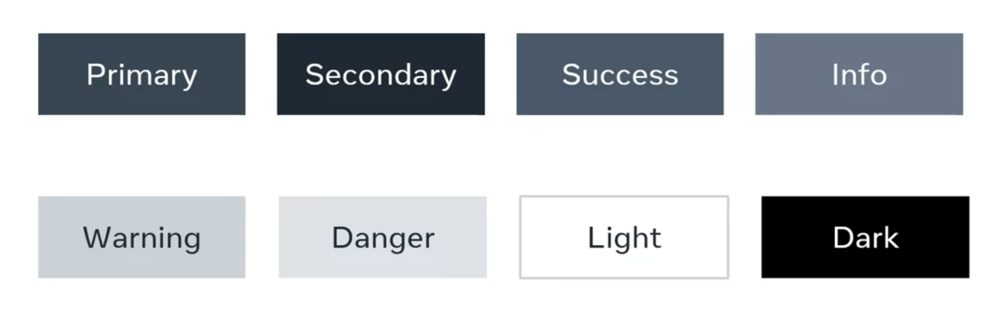

# Bootstrap

Bootstrap is often described as a way to "build fast, responsive sites" and it is a "feature-packed, powerful, and extensible frontend toolkit". 

Some people refer to it as a "front-end" framework, and some are trying to be more specific by referring to it as a "CSS framework" or a “CSS library”. 

So, what is Bootstrap?

**Simply put, Bootstrap is a library of CSS and JavaScript code that you can combine to quickly build visually appealing websites.**

Modern web development is all about **components**. Small pieces of reusable code that allow you to build websites quickly. Bootstrap comes with multiple components for very fast construction of multiple components, or parts of components. 


Another important aspect of modern development is **responsive grids** which allow web pages to adapt their layout and content depending on the device in which they are viewed. Bootstrap comes with a pre-made set of CSS rules for building a responsive grid.

Bootstrap is very popular amongst developers as it saves development time and provides a way for developers to build visually appealing prototypes and websites.




The main difference is hte color used in each alert. For example, the danger alert uses a red color whereas the primary alert uses a blue color. 

Bootstrap modifiers add a CSS class to change the visual style of components. You will use an infix to indicate the breakpoint in Bootstrap CSS rules.  


To build the responsive website. Use responsive grid and responsive library. Bootstraps uses Grid System to design a responsive webs seite. 


Bootstraps grid arrages things 

1. Containers
2. Rows
3. columns


## Static and Dynamic

What is the difference between Webserver and application server? 
**The application server generates the dynamic content that the web server sends back to the user’s browser.** 

It is slow to request dynamic servers. For that reason webservers have  caching. 

Cashing

* A saved copy of dynamic content readly available when request. 
* When the request is new, the webserver will cash the response for future  use.  Basically, when there is a reques, the webserver checks its cache to see if it has the response for that request. if it doesn't;t have the response then it requests the application server.  The webserver sends the dynamic response to the browser. For subsquent request, the webserver immediately sends the content stored in the cache. 


# Single Application Pages

It means one Html per whole webpage. 

## Bundling 

bundling will return all resources immediately 

## Lazy loading. 

lazy loading returns only the minimum required resources.


# React

Java script library. 

React allows developers to write less code to implement functionality in a web browser, it helps them maintain code in the long term and simplifies testing, and it also allows developers to re-use components when building their applications.

React uses a Virtual DOM to represent the browser DOM in memory.


# Python 

Data types

1. Numeric

2. Sequence

3. Dictionary

4. Boolean 

5. Set

   


# Procedure programming

* easy to learn
* Reusable
* Hard to maintain
* Code is exposed through out the progam 


### Alogarithms

Set of instructions to complete a task.

Key to solve the problem is to break the problem into small problem


# Functional Programming

Pure functions are used in functional programming to assure the integrity of data outside the scope of the pure function.     

Advantages of Pure functions

* Known outcome
* Consistent and reriable
* Cache : since you are know the out put each time
* Multi-threaded programs

Example

```python
my_list = [1,2,3]

def add_t_list(lst, item):
    nl = lst.copy()
    nl.append(item)
    return nl

new_list = add_t_list(my_list, 10)
print(my_list) #[1, 2, 3]
print(new_list) # [1, 2, 3, 10]
```

Pure functions does not alter the global variables. 

* Pure functions keep the code cleaner and easy to debug.


# Recursion 

a function that calls itself

### Advantages

* Neat code
* Sub-problems
* Easy sequences

```python
def factorial (n):
    if n <= 1:
        return 1
    return n * factorial( n - 1)

print(factorial(0))
```

### Disadvantages

* Hard to follow
* Memory
* Debugging


## Map and Filter functions

Maps take all objects in a list and applies a function to it.

Filter do the same, but takes the results and creates a new list with only the true values. 


# Comprehensions

four main types of comprehesions in Python:

* List comprehension
* Dictionary comprehension
* Set comprehension
* Generator comprehesion

1. ## List comprehension

   ```python
   [<expression> for x in <sequence> if <condition>]
   ```

   ```python
   # example
   data = [2,3,4,5,5,9, 12, 15]
   
   data_copy = [ x for x in data if x % 2 == 0]
   print(data)
   print (data_copy)
   nines = [x for x in range(len(data)) if x % 2 == 0]
   print (nines)
   ```

   

2. ## Dictionary comprehension

   ```python
   dict = { key: value for key, value in <sequence> if <condition>}
   ```

   ```python
   # dictionary comprehesion 
   
   # Using range() function and no input list
   using_range = {x : x * 2 for x in range(12)}
   print(using_range)
   print()
   # using one list to make a dictionary 
   numbers = [1,2,3,4,5,6,7,8,9,10,11,12]
   months = ["Jan", "Feb", "Mar", "Apr", "May", "June", "July", "Aug", "Sept", "Oct", "Nov", "Dec"]
   
   numdict = { x : x ** 2 for x in numbers}
   print(numdict)
   
   print()
   # using two lists
   month_dict = { key : value for key, value in zip (numbers, months)}
   print(month_dict)
   
   outputs
   {0: 0, 1: 2, 2: 4, 3: 6, 4: 8, 5: 10, 6: 12, 7: 14, 8: 16, 9: 18, 10: 20, 11: 22}
   
   {1: 1, 2: 4, 3: 9, 4: 16, 5: 25, 6: 36, 7: 49, 8: 64, 9: 81, 10: 100, 11: 121, 12: 144}
   
   {1: 'Jan', 2: 'Feb', 3: 'Mar', 4: 'Apr', 5: 'May', 6: 'June', 7: 'July', 8: 'Aug', 9: 'Sept', 10: 'Oct', 11: 'Nov', 12: 'Dec'}
   ```

   

3. ## Set comprehension

4. Deals with the set data type and it is very similar to list comprehension. The only key difference is the use of curly brackets for sets instead of square brackets as in list. Dukoresha {} instead of [] nko muri list comprehension. Iyi nio difference yonyine. 

   ```python3
   set_a = { x for x in range(10) if x % 2 == 0}
   print(set_a)
   
   {0, 2, 4, 6, 8}
   ```

   

5. ## Generator comprehension

   Generator comprehensions are also very similar to lists with the variation of using curved brackets instead of square brackets. They are also more memory efficient as compared to list comprehensions. For example:

   ```python3
   gen_obj = (x for x in data)
   print(gen_obj)
   for x in gen_obj:
       print(x, end = " ")
       
       
   <generator object <genexpr> at 0x100954040>
   2 3 5 7 11 13 17 19 23 29 31 
   ```

   


# OOP

## Advantages:

* Modularity
* Easier to understand
* Reusable
* Abstraction 
* Mpve between Projects

## Key componets 

* Classes : Logical code block that contains attributes and behaviors. A blue print of objects. Atributes can be variables and behaviiors can be methods.
* Objects. an instance of a class. Each has unique attributes to differenatiate it from the other object.  


# 4 Concepts of OOP

1. **Inheritance** : Creating new class which derivative of an existing one. 

2. **Polymorphsim**. Ability of a function to change its behaviors when called by different objects. Can take many form.

3. **Encapsulation**: Limits access to method and variables by enclosing them in a single unit of scope. Help prevent unwanted modifications. and help reduces error.

   Access modifiers represented by keywords such as public, private and protected are used for information hiding. The use of single and double underscores for this purpose in Python is a substitute for this practice. For example, let's examine an example of protected members in Python.

   ```python3
   class Alpha:
   
       def __init__(self):
           self._a = 2 # protected member 'a'
           self.__b = 3 # private mmber 'b'
   
   ```

   

4. **Abstraction**: Hides implementation details for data security. Python does not use abstraction directly, it uses inheritance to achieve it. 

